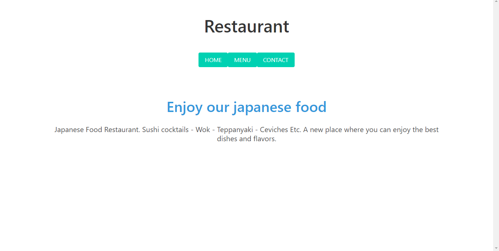

# JS-Restaurant-Page

> In this project I build a small restaurant page with 3 tabs when you click on one of this tabs the content of the page changes. For this project I used webpack and ES6 modules

- Home

 

- Menu

 

## Built With

- HTML
- CSS
- Bulma
- Javascript
- VScode

## Live Demo

<a href="https://raw.githack.com/julian3493/js-restaurant-page/features/dist/index.html" target="_blank">Live version</a>

## Getting Started

To get a local copy up and running follow these simple example steps.

### Setup

- Clone this repository. Type `git clone https://github.com/julian3493/js-restaurant-page.git`
- Navigate to the project folder (js-restaurant-page) `cd js-restaurant-page`
- Open the `index.html` into the folder `dist` with the browser `double click on index.html` if you want to see the app running.
- Open the folder js-restaurant-page(Step 2) with an editor of your preference if you want to see the code.

### Run tests

```
     npx eslint .
```

## Authors
​
👤 **Julian Ramos**
​

[<code></code>](https://github.com/julian3493)
[<code></code>](https://twitter.com/JulianR16893833)
[<code></code>](https://www.linkedin.com/in/julian-ramos-arevalo/)
[<code></code>](mailto:julianramosarevalo@gmail.com)

## 🤝 Contributing

Contributions, issues and feature requests are welcome!

Feel free to check the <a href="https://github.com/julian3493/js-restaurant-page/issues"> issues page</a>.

## Show your support

Give a ⭐️ if you like this project!

## Acknowledgments

- <a href="https://www.theodinproject.com/" target="_blank">The Odin Project</a>
- <a href="https://www.stackoverflow.com/" target="_blank">Stackoverflow</a>
- <a href='https://www.instagram.com/kasokusushibar/?hl=es-la'>Kasoku Sushi Bar</a>